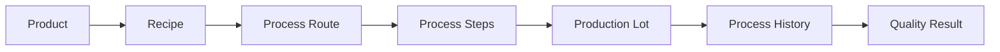
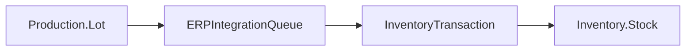
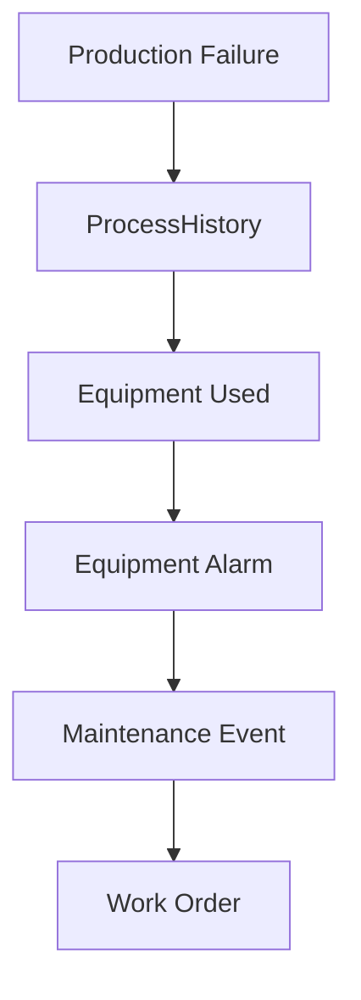
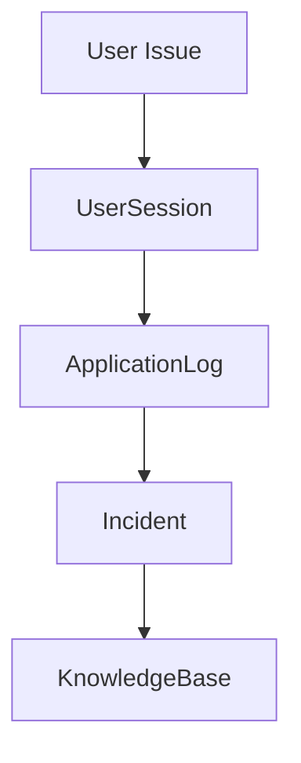

# ProductionERP System Entity Relationship Diagram (ERD)

## Overview

ProductionERP simulates a semiconductor manufacturing environment integrating:

- MES (Manufacturing Execution System)
- ERP (Microsoft Dynamics NAV style processes)
- Equipment Management
- Quality Systems
- Application Support

The overall business flow:

```
Customer Order
      |
      v
Production Lot
      |
      v
MES Processing
      |
      v
Quality Inspection
      |
      v
ERP Inventory Posting
      |
      v
Available Stock
```

---

# System Architecture

```mermaid
flowchart TD

    Customer[Master.Customer]
    Product[Master.Product]
    Employee[Master.Employee]
    Equipment[Master.Equipment]

    Lot[Production.Lot]
    ProcessHistory[Production.ProcessHistory]
    ProcessStep[Production.ProcessStep]
    Route[Production.ProcessRoute]
    RouteStep[Production.ProcessRouteStep]
    Recipe[Production.ProductRecipe]
    Parameter[Production.RecipeParameter]
    Quality[Production.QualityResult]

    Queue[Inventory.ERPIntegrationQueue]
    Transaction[Inventory.InventoryTransaction]
    Warehouse[Inventory.Warehouse]
    Stock[Inventory.Stock]

    Alarm[Maintenance.EquipmentAlarm]
    Event[Maintenance.EquipmentEvent]
    WorkOrder[Maintenance.WorkOrder]

    Logs[Support.ApplicationLog]
    Jobs[Support.BatchJob]
    Execution[Support.BatchJobExecution]
    Incident[Support.Incident]
    Session[Support.UserSession]
    KB[Support.KnowledgeBase]


    Customer --> Lot
    Product --> Lot

    Lot --> ProcessHistory
    ProcessStep --> ProcessHistory
    Equipment --> ProcessHistory

    Product --> Recipe
    Recipe --> Parameter

    Product --> Route
    Route --> RouteStep
    ProcessStep --> RouteStep

    Lot --> Quality


    Lot --> Queue
    Queue --> Transaction

    Product --> Transaction
    Warehouse --> Transaction

    Product --> Stock
    Warehouse --> Stock


    Equipment --> Alarm
    Equipment --> Event
    Equipment --> WorkOrder

    Employee --> WorkOrder
    Employee --> Session
    Employee --> Incident


    Jobs --> Execution

    Execution --> Logs
    Incident --> Logs
```



---

# Manufacturing Execution Flow (MES)

This represents the production floor.



## Explanation

### Product

Defines what is manufactured.

Example:

```
GaN Power Semiconductor
```

↓

### Recipe

Defines how it should be manufactured.

Example:

```
Temperature = 1050 C
Pressure = 50 Torr
Growth Time = 18 Hours
```

↓

### Process Route

Defines the manufacturing sequence.

Example:

```
Preparation
Growth
Inspection
Testing
```

↓

### Production Lot

Represents the actual material being processed.

Example:

```
LOT-GAN-20260918-0145
```

↓

### Process History

Records what actually happened.

Example:

```
Lot entered Reactor 2
Started 10:15 PM
Completed 4:20 AM
```

↓

### Quality Result

Determines if material passes specifications.

---

# MES to ERP Integration Flow



## Support Investigation

If production completed but ERP inventory is missing:

Check:

```
1. Production.Lot

2. ERPIntegrationQueue

3. InventoryTransaction

4. Inventory.Stock
```

---

# Equipment Reliability Flow



## Support Investigation

If yield decreases:

Check:

```
QualityResult
      |
      v
ProcessHistory
      |
      v
Equipment
      |
      v
Alarm History
      |
      v
Maintenance
```

---

# Application Support Flow



## Example

Problem:

> Operator cannot release production order.

Investigation:

```
UserSession
      |
ApplicationLog
      |
Incident History
      |
Known Resolution
```

---

# Core Business Keys

|Business Object|Primary Identifier|
|---|---|
|Customer|CustomerID|
|Product|ProductID|
|Lot|LotID / LotNumber|
|Equipment|EquipmentID|
|Recipe|RecipeID|
|Process Execution|ProcessHistoryID|
|Quality Test|QualityResultID|
|ERP Transaction|InventoryTransactionID|
|Support Ticket|IncidentID|

---

# Most Important Tables for Application Support

## Tier 1 - First Investigation

|Table|Why|
|-|-|
|Support.ApplicationLog|Find errors|
|Support.BatchJobExecution|Check scheduled processes|
|Inventory.ERPIntegrationQueue|Check interfaces|
|Production.Lot|Verify production state|

---

## Tier 2 - Root Cause Analysis

|Table|Why|
|-|-|
|Production.ProcessHistory|Trace manufacturing|
|QualityResult|Find failures|
|EquipmentAlarm|Check machines|
|Maintenance.WorkOrder|Review repairs|

---

# Interview Explanation

A concise explanation:

> "I designed the system around the manufacturing flow. MES owns production execution, recipes, routes, and quality. ERP owns inventory transactions and availability. The integration queue connects the two systems. When issues occur, support engineers trace transactions from the lot through process history, integration messages, ERP postings, and finally inventory."

---

# Common Troubleshooting Paths

## Missing Inventory

```
Lot
 |
ERPIntegrationQueue
 |
InventoryTransaction
 |
Stock
```

---

## Quality Failure

```
QualityResult
 |
ProcessHistory
 |
EquipmentAlarm
 |
Maintenance
```

---

## Interface Failure

```
BatchJobExecution
 |
ApplicationLog
 |
ERPIntegrationQueue
 |
Retry/Reprocess
```

---

## User Problem

```
UserSession
 |
ApplicationLog
 |
Incident
 |
KnowledgeBase
```

---

# Design Philosophy

This database is designed around a support engineer's question:

> "What happened, where did it happen, when did it happen, and how do we prevent it from happening again?"