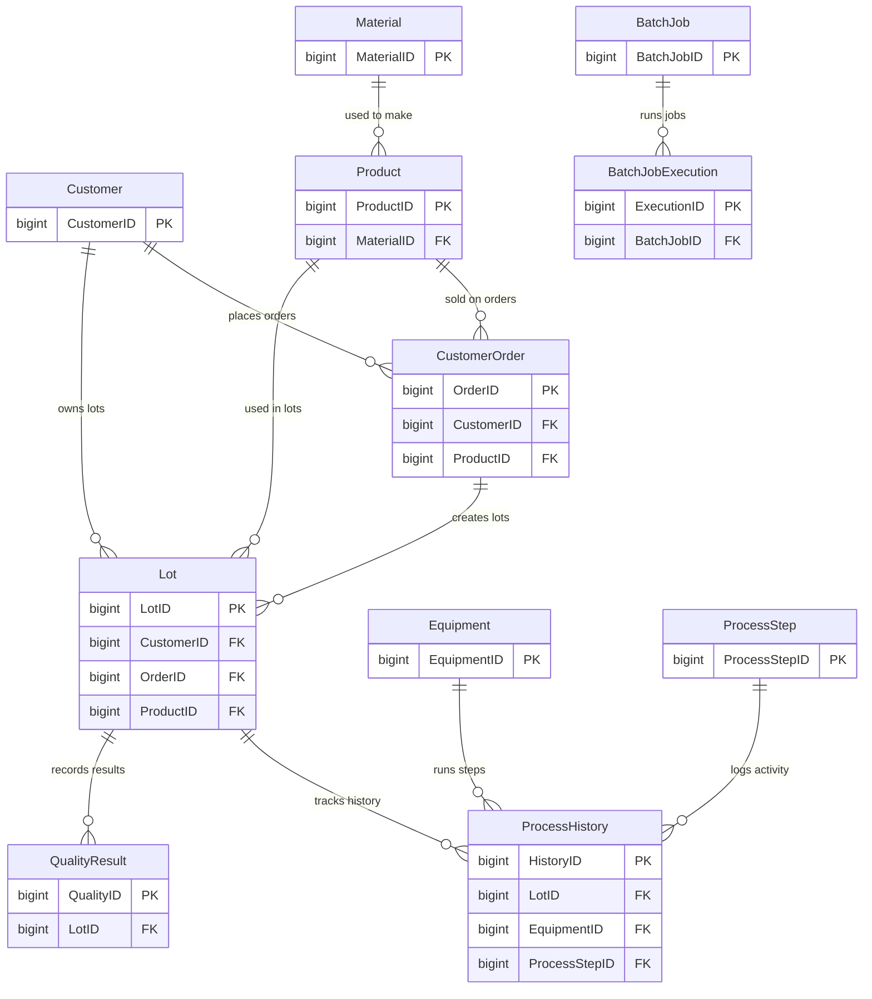

```mermaid
erDiagram
    Customer ||--o{ CustomerOrder : "places orders"
    Customer ||--o{ Lot : "owns lots"
    Product ||--o{ CustomerOrder : "sold on orders"
    Product ||--o{ Lot : "used in lots"
    Material ||--o{ Product : "used to make"
    CustomerOrder ||--o{ Lot : "creates lots"
    Lot ||--o{ ProcessHistory : "tracks history"
    Lot ||--o{ QualityResult : "records results"
    Equipment ||--o{ ProcessHistory : "runs steps"
    ProcessStep ||--o{ ProcessHistory : "logs activity"
    BatchJob ||--o{ BatchJobExecution : "runs jobs"

    Customer {
        bigint CustomerID PK
    }

    CustomerOrder {
        bigint OrderID PK
        bigint CustomerID FK
        bigint ProductID FK
    }

    Product {
        bigint ProductID PK
        bigint MaterialID FK
    }

    Material {
        bigint MaterialID PK
    }

    Lot {
        bigint LotID PK
        bigint CustomerID FK
        bigint OrderID FK
        bigint ProductID FK
    }

    ProcessHistory {
        bigint HistoryID PK
        bigint LotID FK
        bigint EquipmentID FK
        bigint ProcessStepID FK
    }

    Equipment {
        bigint EquipmentID PK
    }

    ProcessStep {
        bigint ProcessStepID PK
    }

    QualityResult {
        bigint QualityID PK
        bigint LotID FK
    }

    BatchJob {
        bigint BatchJobID PK
    }

    BatchJobExecution {
        bigint ExecutionID PK
        bigint BatchJobID FK
    }
```