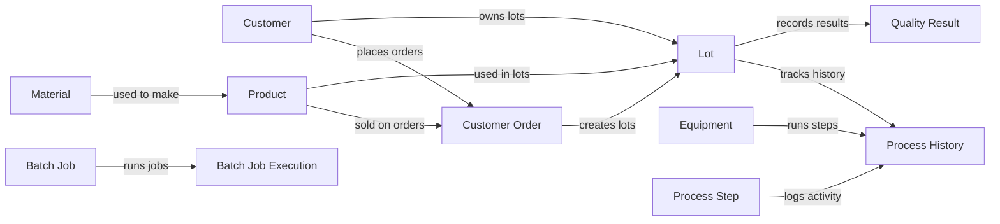

```mermaid
flowchart LR
    Customer[Customer]
    CustomerOrder[Customer Order]
    Lot[Lot]
    Product[Product]
    Material[Material]
    ProcessHistory[Process History]
    QualityResult[Quality Result]
    Equipment[Equipment]
    ProcessStep[Process Step]
    BatchJob[Batch Job]
    BatchJobExecution[Batch Job Execution]

    Customer -->|places orders| CustomerOrder
    Customer -->|owns lots| Lot
    Product -->|sold on orders| CustomerOrder
    Product -->|used in lots| Lot
    Material -->|used to make| Product
    CustomerOrder -->|creates lots| Lot
    Lot -->|tracks history| ProcessHistory
    Lot -->|records results| QualityResult
    Equipment -->|runs steps| ProcessHistory
    ProcessStep -->|logs activity| ProcessHistory
    BatchJob -->|runs jobs| BatchJobExecution
```
